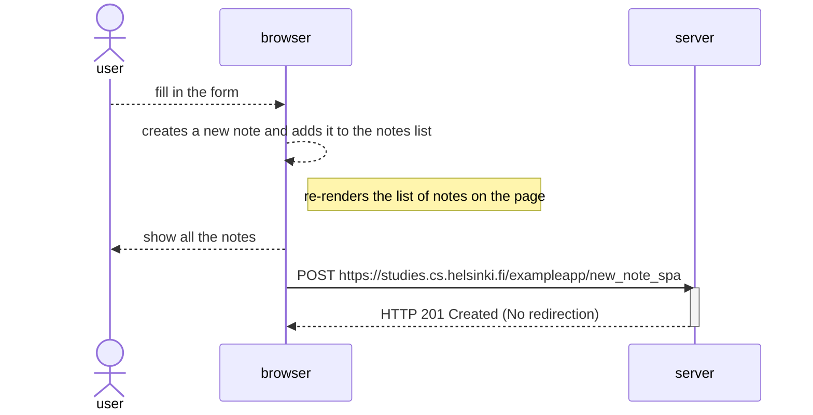

```mermaid 
  sequenceDiagram
    actor user
    participant browser
    participant server

    user-->>browser: fill in the form
    browser-->>browser: creates a new note and adds it to the notes list
    Note right of browser:re-renders the list of notes on the page

    browser-->>user: show all the notes

    browser->>server: POST https://studies.cs.helsinki.fi/exampleapp/new_note_spa
    activate server
    server-->>browser: HTTP 201 Created (No redirection)
    deactivate server
```